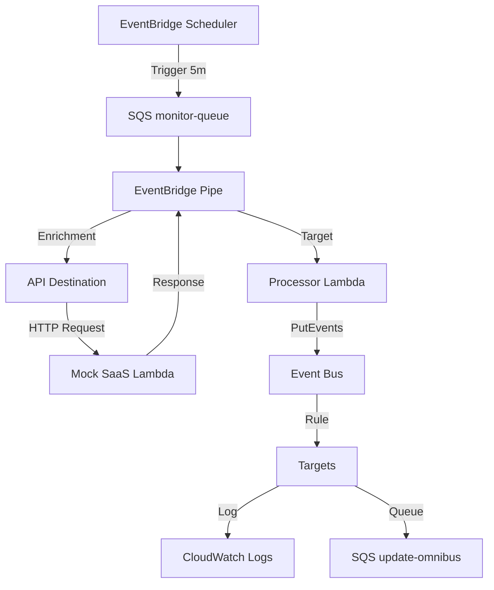

# SaaS Monitor Architecture

This project deploys a modular, serverless SaaS monitoring architecture on AWS using Terraform. It leverages EventBridge Pipes, Scheduler, Lambda, and SQS to create a robust, event-driven monitoring solution.

## Architecture

The system triggers a health check against a SaaS API (mocked in this project) on a schedule, processes the response, and routes the results to downstream targets.



## Features

- **Modular Design**: Built with reusable Terraform modules for Lambda, SQS, Scheduler, Pipes, and EventBridge.
- **Flexible Authentication**: Supports API Key, Basic Auth, and OAuth for the API Destination.
- **Customizable Receiver**: The processor Lambda can be replaced with your own logic via a source path variable.
- **Event-Driven**: Fully asynchronous processing using SQS and EventBridge.
- **Blueprint Ready**: Includes a `blueprint.yaml` manifest for easy cataloging.

## Prerequisites

- [Terraform](https://www.terraform.io/downloads.html) >= 1.0
- [AWS CLI](https://aws.amazon.com/cli/) configured with appropriate credentials.

## Usage

1.  **Initialize Terraform**:
    ```bash
    terraform init
    ```

2.  **Review the Plan**:
    ```bash
    terraform plan
    ```

3.  **Deploy**:
    ```bash
    terraform apply
    ```

## Configuration

You can configure the deployment using the following variables in `variables.tf` or a `terraform.tfvars` file.

| Variable | Description | Default |
|----------|-------------|---------|
| `aws_region` | AWS Region to deploy resources | `eu-central-1` |
| `saas_name` | Name prefix for resources | `noam-saas` |
| `auth_type` | Authentication type (`API_KEY`, `BASIC`, `OAUTH`, `NONE`) | `API_KEY` |
| `api_key_config` | Configuration for API Key auth | `{ key = "x-api-secret", value = "..." }` |
| `basic_auth_config` | Configuration for Basic auth | `null` |
| `oauth_config` | Configuration for OAuth | `null` |
| `processor_source_path` | Path to custom processor Lambda code | `src/processor/processor.py` |

## Modules

The project is organized into the following modules in `modules/`:

- **`api-destination`**: Manages EventBridge Connection and API Destination.
- **`eventbridge`**: Manages Event Bus, Rules, Targets, and Log Groups.
- **`lambda`**: Deploys Lambda functions with IAM roles and optional Function URLs.
- **`pipe`**: Deploys EventBridge Pipes.
- **`scheduler`**: Deploys EventBridge Schedules.
- **`sqs`**: Deploys SQS queues and policies.

## Blueprint

This project includes a `blueprint.yaml` file that describes the architecture, inputs, and outputs in a machine-readable format, suitable for integration with blueprint catalogs or platform engineering tools.
