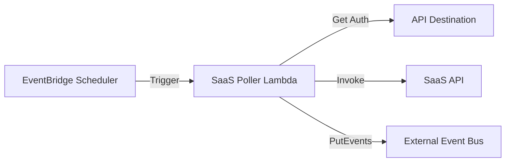

# SaaS Monitor Architecture

A modular serverless architecture for monitoring SaaS applications using AWS EventBridge Scheduler, Lambda, and API Destinations.

## Architecture



## Features

- **Serverless Polling**: Uses EventBridge Scheduler to trigger checks.
- **Secure Authentication**: Supports API Key, Basic Auth, and OAuth (Client Credentials) via EventBridge API Destinations.
- **VPC Integration**: Deploys Lambda functions into your VPC for secure networking.
- **Modular Design**: Built with reusable Terraform modules.

## Prerequisites

- Terraform >= 1.0
- AWS Credentials configured

## Usage

1.  **Clone the repository**:
    ```bash
    git clone <repository-url>
    cd SaaS-monitor
    ```

2.  **Initialize Terraform**:
    ```bash
    terraform init
    ```

3.  **Configure Variables**:
    Create a `terraform.tfvars` file or pass variables via command line. **VPC configuration is mandatory.**

    ```hcl
    saas_name          = "my-saas-app"
    vpc_id             = "vpc-xxxxxxxx"
    private_subnet_ids = ["subnet-xxxxxx", "subnet-yyyyyy"]
    auth_type          = "API_KEY"
    api_key_config     = {
      key   = "x-api-key"
      value = "my-secret-key"
    }
    ```

4.  **Deploy**:
    ```bash
    terraform apply
    ```

## Inputs

| Name | Description | Type | Required | Default |
|------|-------------|------|:--------:|---------|
| `aws_region` | AWS Region | `string` | No | `eu-central-1` |
| `saas_name` | Name of the SaaS application | `string` | No | `noam-saas` |
| `vpc_id` | ID of the VPC | `string` | **Yes** | - |
| `private_subnet_ids` | List of private subnet IDs | `list(string)` | **Yes** | - |
| `auth_type` | Auth type (API_KEY, BASIC, OAUTH, NONE) | `string` | No | `API_KEY` |
| `event_bus_name` | External Event Bus name | `string` | No | `ops-main-cust-bus` |

## Outputs

- `saas_poller_lambda_arn`: ARN of the SaaS Poller Lambda.
- `api_destination_arn`: ARN of the API Destination.
- `mock_saas_url`: URL of the Mock SaaS API (for testing).
- `lambda_security_group_id`: ID of the automatically created Security Group.

## Modules

- **`lambda`**: Generic Lambda function module.
- **`scheduler`**: EventBridge Scheduler module.
- **`api-destination`**: API Destination and Connection module.
