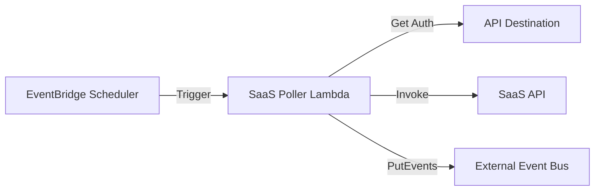

You can configure the deployment using the following variables in `variables.tf` or a `terraform.tfvars` file.

| Variable | Description | Default |
|----------|-------------|---------|

1.  **EventBridge Scheduler**: Triggers the SaaS Poller Lambda every 5 minutes.
2.  **SaaS Poller Lambda**:
    *   Retrieves API Destination details and authentication.
    *   Invokes the SaaS API (or the **Mock SaaS Lambda** for testing).
    *   Parses the response.
    *   Sends events to the **External Event Bus**.
re, inputs, and outputs in a machine-readable format, suitable for integration with blueprint catalogs or platform engineering tools.
