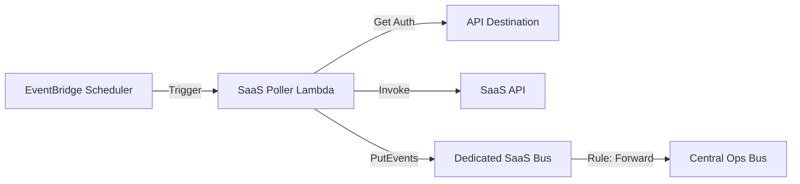

# SaaS Monitor Architecture

A modular serverless architecture for monitoring SaaS applications using AWS EventBridge Scheduler, Lambda, and EventBridge Bus. It triggers a SaaS Poller Lambda on a schedule, which fetches data from a SaaS API and publishes events to a dedicated SaaS Event Bus, forwarding them to a central operations bus.

## Architecture



## Features

-   **Serverless Polling**: Uses EventBridge Scheduler to trigger checks.
-   **Dedicated Event Bus**: Each SaaS has its own EventBridge Bus for isolation.
-   **Event Forwarding**: Automatically forwards health check events to a central Operations Bus.
-   **Schema Validation**: Defines and validates events using EventBridge Schema Registry.
-   **Dynamic Networking**: Automatically detects VPC and Subnets (requires `Routable=1` tag).
-   **Secure Authentication**: Supports API Key, Basic Auth, and OAuth via EventBridge API Destinations.
-   **Modular Design**: Built with reusable, Blueprint-ready Terraform modules.

## Prerequisites

-   Terraform >= 1.0
-   AWS Credentials configured

## Usage

1.  **Clone the repository**:
    ```bash
    git clone <repository-url>
    cd SaaS-monitor
    ```

2.  **Initialize Terraform**:
    ```bash
    terraform init
    ```

3.  **Configure Variables**:
    Create a `terraform.tfvars` file or pass variables via command line.

    ```hcl
    saas_name                = "my-saas-app"
    target_url               = "https://api.mysaas.com/health"
    ops_main_events_bus_name = "operational-main-events-bus"
    
    auth_config = {
      mode = "API_KEY"
      api_key = {
        key   = "x-api-key"
        value = "my-secret-key"
      }
    }
    ```

4.  **Deploy**:
    ```bash
    terraform apply
    ```

## Inputs

| Name | Description | Type | Default |
|------|-------------|------|---------|
| `aws_region` | AWS Region | `string` | `eu-central-1` |
| `aws_profile` | AWS Profile | `string` | `sandbox` |
| `saas_name` | Name of the SaaS application | `string` | `noam-saas` |
| `target_url` | URL of the SaaS API to monitor | `string` | `https://api.example.com/health` |
| `ops_main_events_bus_name` | Name of the central Ops Bus | `string` | `operational-main-events-bus` |
| `auth_config` | Authentication configuration | `object` | `API_KEY` |
| `api_destination_name` | Custom name for API Destination | `string` | `null` |
| `connection_name` | Custom name for Connection | `string` | `null` |

## Outputs

-   `saas_poller_lambda_arn`: ARN of the SaaS Poller Lambda.
-   `api_destination_arn`: ARN of the API Destination.
-   `saas_event_bus_arn`: ARN of the dedicated SaaS Event Bus.
-   `lambda_security_group_id`: ID of the automatically created Security Group.

## Modules

-   **`event-bridge-bus`**: Manages EventBridge Bus, Rules, and Targets.
-   **`schema-registry`**: Manages EventBridge Schema Registry and Schemas.
-   **`security-group`**: Manages Security Groups and Rules.
-   **`lambda`**: Generic Lambda function module.
-   **`scheduler`**: EventBridge Scheduler module.
-   **`api-destination`**: API Destination and Connection module.
